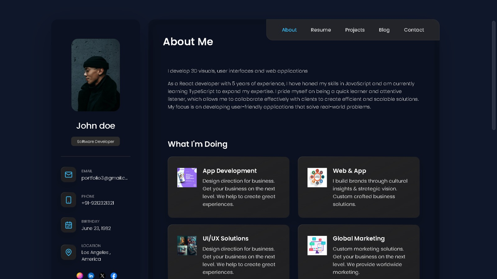

# Portfolyo - Portfolio Website

This is an assignment based project is a portfolio website created for showcasing your skills, projects, and experiences to potential employers or clients. Portfolyo is built using React and Vite, providing a fast and efficient development environment.

## Images



## Features

- **Responsive Design**: Ensures optimal viewing experience across various devices.
- **Dynamic Content**: Easily update and customize your portfolio content.
- **Project Showcase**: Highlight your projects with descriptions, images, and links.
- **Skills Section**: Showcase your skills and expertise.
- **Contact Form**: Allow visitors to reach out to you easily through a contact form.
- **Fast Performance**: Built with Vite for blazing-fast development and production builds.

## Installation

1. Clone the repository:

    ```bash
    git clone https://github.com/Sayakdutt/portfolyo-website-assignment
    ```

2. Navigate to the project directory:

    ```bash
    cd portfolyo-website-assignment
    ```

3. Install dependencies:

    ```bash
    npm install
    ```

## Usage

1. Start the development server:

    ```bash
    npm run dev
    ```

    This will start the development server and open the project in your default web browser.

## Deployment

Deployed it on netlify

Live Site:- [Portfolyo website](https://portfolyo-website.netlify.app/)
